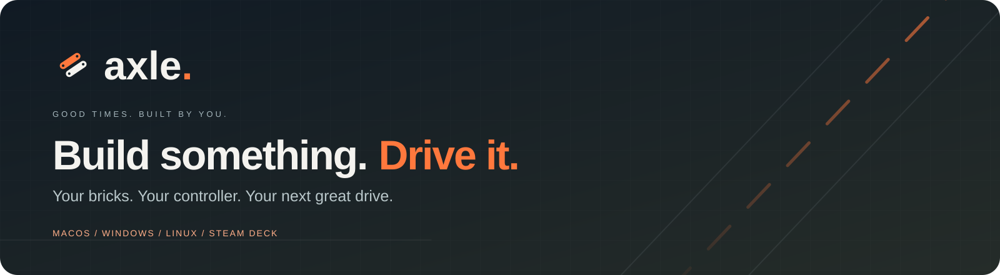
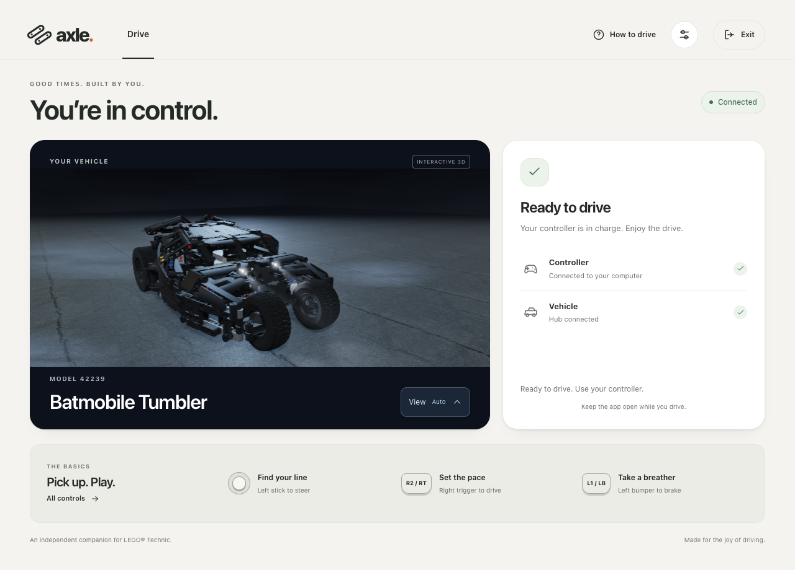
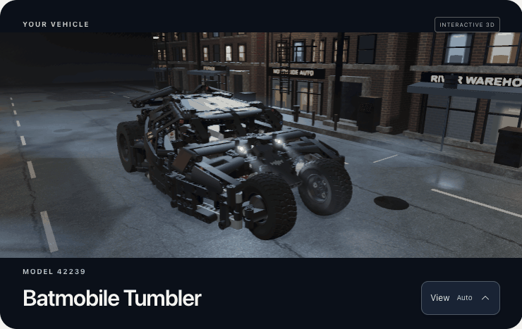
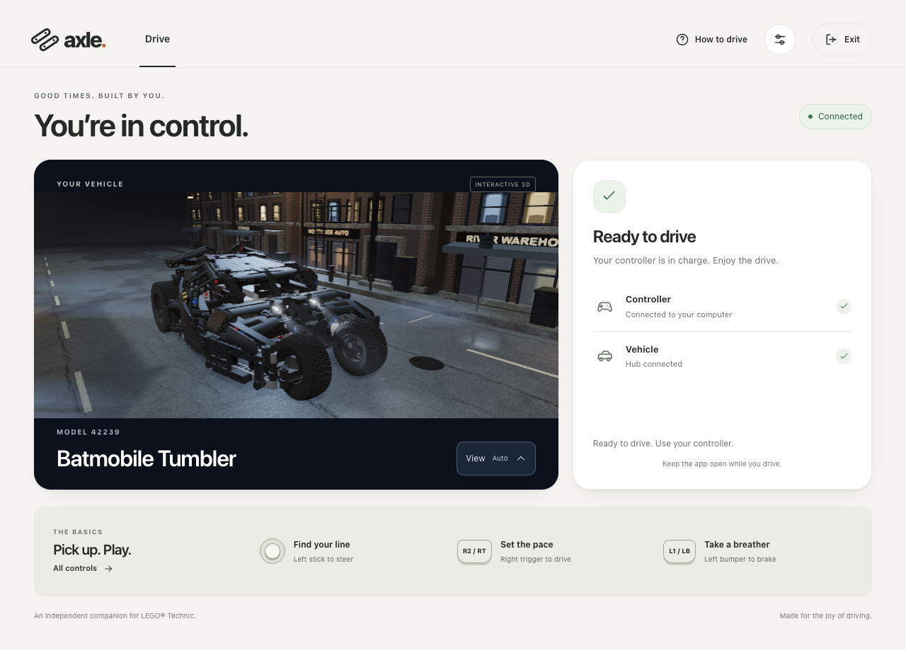

<div align="center">



# Axle

### Your bricks. Your controller. A proper cockpit.

Turn a compatible Technic vehicle into a gamepad-driven machine — with a live 3D companion, cinematic cameras, lights and feedback.

[](https://github.com/o-raskin/axle-app/actions/workflows/release.yml)
[](#start-from-a-release)
[](LICENSE)

**[Get Axle](https://github.com/o-raskin/axle-app/releases/latest)** &nbsp;·&nbsp;
**[Learn the controls](#controls)** &nbsp;·&nbsp;
**[Build something new](#contributing)** &nbsp;·&nbsp;
**[Release guide](docs/release-pipeline.md)**



<sub>Actual Axle UI. Screenshots and animation use simulated vehicle telemetry, not a live hardware session. <a href="docs/media/README.md">Capture notes and credits</a>.</sub>

</div>

Axle is an independent desktop and terminal companion for the **LEGO Technic Move Hub (88019)**. The current vehicle profile is the **42239 Batmobile Tumbler**. Connect your controller, power on the hub, and Axle takes care of discovery, calibration and reconnecting.

> [!NOTE]
> Application code is **Apache-2.0**. The bundled Tumbler assembly is by **포기남 (Fogeyman)** under **CC BY-NC 4.0**, with separately licensed LDraw geometry. Model assets are not Apache-2.0 or cleared for unrestricted commercial use; some embedded geometry and underlying design rights remain unverified. [Asset licenses and rights →](#licenses-and-credits)

---

<a id="the-experience"></a>

## ✨ Small car. Big atmosphere.

<table>
<tr>
<td width="33%" valign="top"><strong>🎮 Feel the drive</strong><br><br>Analog throttle and steering, three power modes, braking and timed boost. Rumble and supported DualSense LEDs respond to the car's state.</td>
<td width="33%" valign="top"><strong>🛞 See real movement</strong><br><br>The 3D wheels follow measured drivetrain movement, including reverse, coasting and stalls. Steering and lamps follow resolved control signals.</td>
<td width="33%" valign="top"><strong>🎬 Find the best angle</strong><br><br>Smooth cameras follow active parts, driving and boost. Orbit and zoom yourself, or choose a view from the compact View menu.</td>
</tr>
<tr>
<td valign="top"><strong>🌃 Take the night route</strong><br><br>An optional street scene brings damp asphalt, masonry, warm street lamps, haze and headlight beams. The street moves with measured wheel travel.</td>
<td valign="top"><strong>🔄 Keep the flow moving</strong><br><br>Axle searches on launch, prepares the vehicle automatically and reconnects after device loss. Settings remain available throughout setup.</td>
<td valign="top"><strong>🧰 Keep your tools</strong><br><br>A standalone terminal edition provides guided driving, controller inspection and hub diagnostics. Packaged editions include their Python runtime.</td>
</tr>
</table>

<div align="center">



<sub>A desktop companion that moves with your model.</sub>

</div>

**Make it your view.** Drag to orbit, scroll to zoom, or use keyboard arrows, **+ / −** and **Home**. **Follow active part** is on by default; manual camera movement pauses following. Turn on **View → Street scene** for the night avenue. Reduced-motion preferences suppress automatic camera movement, wheel motion and light pulses.

<details>
<summary><strong>🌙 A closer look at the night scene</strong></summary>

<br>



The scene combines photographed CC0 surface maps, a night-city HDR environment, contact shadows, soft shadow edges, wet-road reflections and depth-aware volumetric lighting. It runs locally with bundled assets. This is portable WebGL rendering; it does not require NVIDIA RTX or claim hardware ray tracing.

Read the [desktop rendering notes](ui/electron/README.md) or explore the [environment sources and credits](ui/electron/environment/README.md).

</details>

---

<a id="start-from-a-release"></a>

## 🚀 Start from a release

### 1 · Pick your cockpit

Download a published build from **[GitHub Releases](https://github.com/o-raskin/axle-app/releases/latest)**. Desktop and terminal editions are self-contained; you do not need to install Python or Node.js to use them.

| Your machine | Axle desktop | Terminal edition |
| :--- | :--- | :--- |
| 🍎 macOS · Apple Silicon | `Axle-VERSION-mac-arm64.dmg` or `.zip` | `…-vVERSION-macos-arm64.tar.gz` |
| 🍎 macOS · Intel | `Axle-VERSION-mac-x64.dmg` or `.zip` | `…-vVERSION-macos-x64.tar.gz` |
| 🪟 Windows · x64 | `Axle-VERSION-win-x64.exe` | `…-vVERSION-windows-x64.zip` |
| 🐧 Linux · x64 | `Axle-VERSION-linux-x86_64.AppImage` or `…-linux-amd64.deb` | `…-vVERSION-linux-x64.tar.gz` |
| 🎮 Steam Deck | The same Linux x64 **AppImage** | The same Linux x64 archive |

`VERSION` is the release number. Terminal archive names begin with `lego-technic-gamepad-bridge`; extract them before running the executable. Releases include **`SHA256SUMS`** and **`release-manifest.json`** for checking downloads.

<details>
<summary><strong>🍎 macOS · first-launch approval</strong></summary>

Axle's macOS builds are ad-hoc signed, without Apple Developer ID signing or notarization. macOS therefore requires approval for your trusted downloaded copy.

1. Copy **Axle** from the DMG or extracted ZIP into **Applications**, then open it.
2. If Apple says it could not verify Axle, dismiss the alert with **Done**.
3. Open **System Settings → Privacy & Security → Security → Open Anyway**, then confirm **Open**.

If the button is missing, try opening Axle again. See [Apple's instructions](https://support.apple.com/en-us/102445); the DMG also includes **Open Axle on macOS.txt**.

If graphical approval is unavailable, this fallback removes quarantine only from the Axle copy in Applications. Use it only for a download you trust; compare its checksum with the release's `SHA256SUMS` first.

```bash
xattr -dr com.apple.quarantine /Applications/Axle.app
open /Applications/Axle.app
```

For the extracted terminal executable:

```bash
xattr -dr com.apple.quarantine ./lego-technic-gamepad-bridge
./lego-technic-gamepad-bridge
```

</details>

<details>
<summary><strong>🎮 Steam Deck &amp; Linux · launch the AppImage</strong></summary>

On Steam Deck, download in **Desktop Mode**. In the AppImage's **Properties → Permissions**, enable **Is executable**, then open it. Browser downloads do not preserve executable permission.

```bash
chmod +x ./Axle-VERSION-linux-x86_64.AppImage
./Axle-VERSION-linux-x86_64.AppImage
```

For **Game Mode**, add the AppImage to Steam as a **Non-Steam Game** and choose a gamepad Steam Input layout. Leave **Force the use of a specific Steam Play compatibility tool** unchecked: Axle is a native Linux app.

The AppImage bundles its FUSE library; you do not need to install FUSE 2 on SteamOS. If mounting is unavailable:

```bash
./Axle-VERSION-linux-x86_64.AppImage --appimage-extract-and-run
```

</details>

### 2 · Bring your hardware

You need **Bluetooth**, a **Technic Move Hub (88019)** in the supported Tumbler model, and a compatible controller. Shipped profiles cover **Sony DualSense**, **Steam Deck / Steam Input**, and a generic **SDL/XInput** fallback. Controller-specific LEDs and speaker feedback depend on what the host exposes.

### 3 · Power on. Let Axle prepare. Drive.

1. Enable Bluetooth and connect your controller to the computer.
2. Open Axle and press the vehicle hub's power/connect button.
3. Axle discovers the devices, prepares PLAYVM and calibrates the model. When it is ready, use the triggers and stick to drive.

> [!IMPORTANT]
> Keep the vehicle stationary with its wheels clear of the ground during the first setup. Live control starts automatically once preparation finishes and can move the model immediately.

Device loss stops the live session and returns to reconnecting. The top-right **Exit** button stops the bridge before closing, including in fullscreen. Vehicle selection lives in **Settings**; the desktop currently exposes Tumbler only.

<details>
<summary><strong>⬆️ Updates stay under your control</strong></summary>

Installed builds check for a newer stable GitHub release at startup; **Help → Check for updates…** retries manually. A network failure does not block launch, and checks do not interrupt an active vehicle session.

- **Windows / AppImage:** confirm the download, then separately confirm restarting to install. Vehicle control stops first. Normal app exit does not install an update.
- **Steam Deck:** AppImage replacement keeps the existing filename so Steam shortcuts remain valid. Its containing directory must be writable.
- **macOS / Linux deb:** Axle offers the matching package for manual installation. macOS approval still applies.

Development builds do not check. Older releases without this feature need one manual upgrade. See the [update implementation and verification](docs/release-pipeline.md#desktop-updates).

</details>

---

<a id="controls"></a>

## 🎮 Learn the controls in one lap

| Action | DualSense | Steam Deck / Xbox-style |
| :--- | :--- | :--- |
| Steer | Left stick X | Left stick X |
| Forward / reverse | **R2 / L2** | **RT / LT** |
| Select power: **25% · 50% · 100%** | D-pad Up / Down | D-pad Up / Down |
| Brake and cancel boost | **L1** | **LB** |
| Boost | **R1** | **RB** |
| Toggle front lights when stopped | Square | X |
| Attack / one-second light flicker | Circle | B |
| Safe exit | Options / Esc | Menu / Start / Esc |

**Boost** lasts 1.95 seconds with a 7.5-second cooldown. **Forward lights**, **reverse green signals** and the 3D lamps follow the model's resolved state. The preview's wheels follow encoder feedback, rather than guessed speed from trigger pressure.

DualSense feedback adds power-mode LED brightness, reverse green/white pulses, orange boost lighting and rumble. Reverse audio uses the controller speaker when macOS exposes it, otherwise the current system output.

<details>
<summary><strong>🛡️ Stopping, impacts and feedback details</strong></summary>

Brake ignores throttle while held and cancels an active boost. A hub-reported PLAYVM **impact** at 30% or more current/recent drive power starts a three-second control lockout, with red LED and rumble on supported controllers. Releasing a trigger or braking does not count as an impact.

Exit and device loss run motor-stop, LED cleanup and BLE-disconnect handling. The terminal also accepts **Ctrl+C** or **Esc** for safe exit.

Reverse audio can be configured when launching from a terminal:

```bash
REVERSE_BEEP_OUTPUT=default python gamepad_bridge.py  # use system audio
REVERSE_BEEP_OUTPUT=off python gamepad_bridge.py      # disable the beep
```

Use `DUALSENSE_AUDIO_DEVICE="Your output name"` for a differently named controller speaker. List outputs with `--audio-devices`.

</details>

---

<a id="terminal-and-diagnostics"></a>

## 🧭 Prefer a terminal? You have a cockpit there, too.

The terminal edition starts a guided model/device flow and displays throttle, steering, power modes, boost, lights and controller feedback. Choose with keyboard **Up / Down + Enter**, or controller **D-pad + A / Cross**.

```bash
./lego-technic-gamepad-bridge                         # guided live control
./lego-technic-gamepad-bridge --model tumbler
./lego-technic-gamepad-bridge --scan-hub               # inspect ports without driving
./lego-technic-gamepad-bridge --probe                  # inspect controller input, no hub
./lego-technic-gamepad-bridge --gamepad-devices
./lego-technic-gamepad-bridge --audio-devices
```

On Windows, use the executable's `.exe` suffix. From source, replace `./lego-technic-gamepad-bridge` with `python gamepad_bridge.py`. Set `CAR_DASHBOARD=off` for ordinary scrolling logs.

<details>
<summary><strong>🔎 Connection troubleshooting and advanced overrides</strong></summary>

**In the desktop:** enable **Settings → Developer mode → Diagnostics** for logs, hub inspection, controller reports, live input probes and audio-device inventory. Include the app version, platform and relevant startup/error lines when contacting [the maintainer](https://github.com/o-raskin) or proposing a fix in a [pull request](https://github.com/o-raskin/axle-app/pulls).

**Steam Deck controller missing?** Launch through Steam with a gamepad layout, or switch Desktop Mode controls into gamepad mode. The `--gamepad-devices` report should show `controller_count > 0` and `is_controller=True` for a Steam Virtual Gamepad, Steam Deck or Xbox-style device. `joystick_count=0` is acceptable when SDL controller entries are present. If neither API sees a device, Axle needs a gamepad-visible Steam Input path.

**Several hubs nearby?** The default name is `Technic Move`. Select the exact hub by BLE address:

```bash
./lego-technic-gamepad-bridge --scan-hub --address 44:3E:8A:7B:A4:EC
./lego-technic-gamepad-bridge --gamepad dualsense
./lego-technic-gamepad-bridge --gamepad steamdeck
```

Terminal runtime state is stored under `~/Library/Application Support/LEGO Technic Gamepad Bridge/` on macOS, or `~/.lego-technic-gamepad-bridge/` otherwise. Set `LEGO_BRIDGE_HOME=/some/path` to override it. The desktop keeps bridge state alongside its settings in Electron's user-data directory.

</details>

---

<a id="development"></a>

## 🛠️ Open the hood

### Run the desktop from source

Use **Python 3.9+** and **Node.js 24 LTS (24.12+)**. Release packaging uses Python 3.12. Run these commands from the **repository root**:

```bash
python3 -m venv lego-env
source lego-env/bin/activate
python -m pip install --upgrade pip
python -m pip install -r requirements.txt

npm --prefix ui/electron ci
npm --prefix ui/electron run dev
```

On Windows, use `python` instead of `python3` to create the environment, then activate with `lego-env\Scripts\Activate.ps1` in PowerShell. For the terminal edition, run `python gamepad_bridge.py --model tumbler --gamepad auto` after Python setup.

**The Node package lives in `ui/electron`, not the repository root.** Use `npm --prefix ui/electron …`, or change into that directory before using npm.

The development app finds the source checkout automatically. `LEGO_BRIDGE_PYTHON=/path/to/python` selects an interpreter; `LEGO_BRIDGE_PROJECT_ROOT=/path/to/repo` overrides source discovery. Python dependencies must be installed in the selected environment.

### Follow the boundaries

```text
Gamepad ──► Python bridge ◄──BLE──► Technic Move Hub
                 │
           JSON Lines protocol
                 │
        Electron main / preload
                 │
        React UI + Three.js scene
```

Python owns device discovery, PLAYVM, model behavior, telemetry and shutdown. Electron starts the bridge, validates structured events and renders the experience. Packaged apps run a bundled native bridge; development runs the Python source.

| Want to work on… | Start here |
| :--- | :--- |
| Controllers and normalization | [`bridge/gamepads/`](bridge/gamepads/) · [`config/gamepads/`](config/gamepads/) |
| Vehicle profiles and behavior | [`bridge/cars/`](bridge/cars/) · [`config/models/`](config/models/) |
| Platform integration | [`bridge/platforms/`](bridge/platforms/) |
| Desktop, IPC and 3D rendering | [`ui/electron/`](ui/electron/README.md) |
| Editable model sources and conversion | [`models/tumbler/`](ui/electron/models/tumbler/README.md) |
| Materials, environment and provenance | [`environment/`](ui/electron/environment/README.md) |
| Native builds and verification | [`scripts/`](scripts/) · [release guide](docs/release-pipeline.md) |

### Check your changes

```bash
python -m ruff check .
python -m ruff format --check .
python -m pytest tests -q

npm --prefix ui/electron run lint
npm --prefix ui/electron run test:coverage
npm --prefix ui/electron run build
npm --prefix ui/electron run test:ui
```

Tests use simulated hardware; a hub and controller are not required. UI tests exercise a real Electron window and 3D viewer. Linux headless setup and software-rendering options are documented in the [desktop guide](ui/electron/README.md). Optional local Python hooks: `python -m pip install pre-commit`, then `pre-commit install`.

For packaging, install `requirements-build.txt` in your Python environment, build the terminal runtime with `python scripts/build_release.py`, then run the matching native `dist:mac`, `dist:win`, `dist:linux` or `dist:steamdeck` command in the Electron package. Follow the [complete native build recipe](docs/release-pipeline.md#local-reproduction).

---

<a id="builds-and-releases"></a>

## 📦 Build often. Release deliberately.

**Every push to `main` builds and validates every supported distribution. It does not create a release or tag.** Pull requests run the same verification suite.

| Gate | What it checks |
| :--- | :--- |
| 🧹 Source quality | Python lint, formatting and strict types; workflow validation; Electron lint and types |
| 🧪 Behavior | Python minimum-runtime compatibility, native unit tests, Electron tests and real-window UI checks |
| 🖥️ Native packages | macOS arm64 / x64, Windows x64 and Linux x64 terminal + desktop builds |
| 🔐 Package integrity | Frozen resources, installed/extracted app launch, macOS signatures, AppImage launch paths and complete checksummed inventory |

Successful **[Build distributions](https://github.com/o-raskin/axle-app/actions/workflows/release.yml)** runs retain a **`verified-release`** bundle for 30 days: all platform files, update feeds, checksums and the release manifest. Versions use the package's major/minor and the build workflow's run number. These are build artifacts until a maintainer chooses to release them.

### A calm release day

1. Choose a successful **Build distributions** run from `main` and copy its **run ID**.
2. Open **[Prepare release draft](https://github.com/o-raskin/axle-app/actions/workflows/prepare-release.yml) → Run workflow** on `main`; enter that ID as `build_run_id`.
3. Follow the draft link in the workflow summary. Review the notes and assets, then click **Publish release** yourself.

The draft workflow uses the **exact verified artifacts**, rechecks their provenance and hashes, and includes every supported build. It does not rebuild or publish automatically. Only published stable releases are offered by the app's updater.

The aggregate verification check rejects failed **or skipped** prerequisites. Package checks cover launch and integrity; real Bluetooth operation, Steam Input in Deck Game Mode and device-specific behavior still need hardware acceptance. Read the [release guide](docs/release-pipeline.md) for details and recovery steps.

---

<a id="contributing"></a>

## 💚 Help the next build go further

Have another vehicle on your shelf? A controller with an unusual SDL name? An idea for a better cockpit? There is room to build here.

| Your contribution | A useful first step |
| :--- | :--- |
| 🚙 Another vehicle | Add a model profile and its car-specific runtime behavior; document its hub/port setup and verify it with wheels off the ground. |
| 🎮 Another controller | Share a Diagnostics controller report, add or refine its JSON profile, and cover normalized input mappings. |
| 🎨 A better experience | Improve cameras, accessibility, UI or environment details; include before/after screenshots for visual changes. |
| 🐛 A reliable fix | Share steps, version, platform and relevant logs; add a regression test for behavior changes. |
| 📚 A clearer guide | Improve first-run instructions, platform notes, translations or troubleshooting. |

**[Send a pull request](https://github.com/o-raskin/axle-app/pulls)** with a focused change and its validation described. Use a draft pull request to explore a substantial proposal, or contact [the maintainer](https://github.com/o-raskin). The repository currently has Issues and Discussions disabled. The [desktop guide](ui/electron/README.md), [product design notes](docs/product-redesign.md) and [engineering audit](docs/engineering-audit.md) provide context.

Keep new assets' provenance and license terms with their sources. Contributions to application code follow the repository's Apache-2.0 license; imported art and models need their own compatible permissions.

---

<a id="licenses-and-credits"></a>

## 🧾 Built with care. Credited clearly.

| Material | Terms and attribution |
| :--- | :--- |
| Application code and original procedural environment | [Apache-2.0](LICENSE), repository contributors |
| Tumbler Studio assembly | **포기남 (Fogeyman)**, **CC BY-NC 4.0**; [model license](ui/electron/models/tumbler/LICENSE.md) |
| LDraw geometry and embedded model parts | Per-file contributors and applicable terms; [part notices](ui/electron/models/tumbler/generated/THIRD-PARTY-NOTICES.md) |
| Environmental surface maps and HDR | Poly Haven artists, **CC0**; [sources, artists and hashes](ui/electron/environment/README.md) |
| Bundled runtime dependencies | [Third-party software notices](ui/electron/resources/THIRD-PARTY-SOFTWARE-NOTICES.txt) |

The model's separate noncommercial terms apply to its generated previews and redistributed assets, including the vehicle shown in this README. Some custom/embedded mesh permissions and underlying vehicle-design rights have not been independently cleared. Read the [rights and distribution record](ui/electron/models/tumbler/RIGHTS.md) before reusing or redistributing these assets. Attribution does not supply missing permission.

Axle is independent of and is not sponsored, authorized or endorsed by the LEGO Group, DC, Warner Bros., the model author or LDraw contributors. **LEGO®** is a trademark of the LEGO Group; Technic, Batman, Batmobile and other product names and related rights belong to their respective rights holders. Names identify compatible hardware or the represented vehicle, not an affiliation.

<div align="center">

**Built for curious drivers, patient tinkerers and one more lap around the living room.**

[Get Axle](https://github.com/o-raskin/axle-app/releases/latest) &nbsp;·&nbsp;
[Contribute](https://github.com/o-raskin/axle-app/pulls) &nbsp;·&nbsp;
[Explore the desktop](ui/electron/README.md)

</div>
