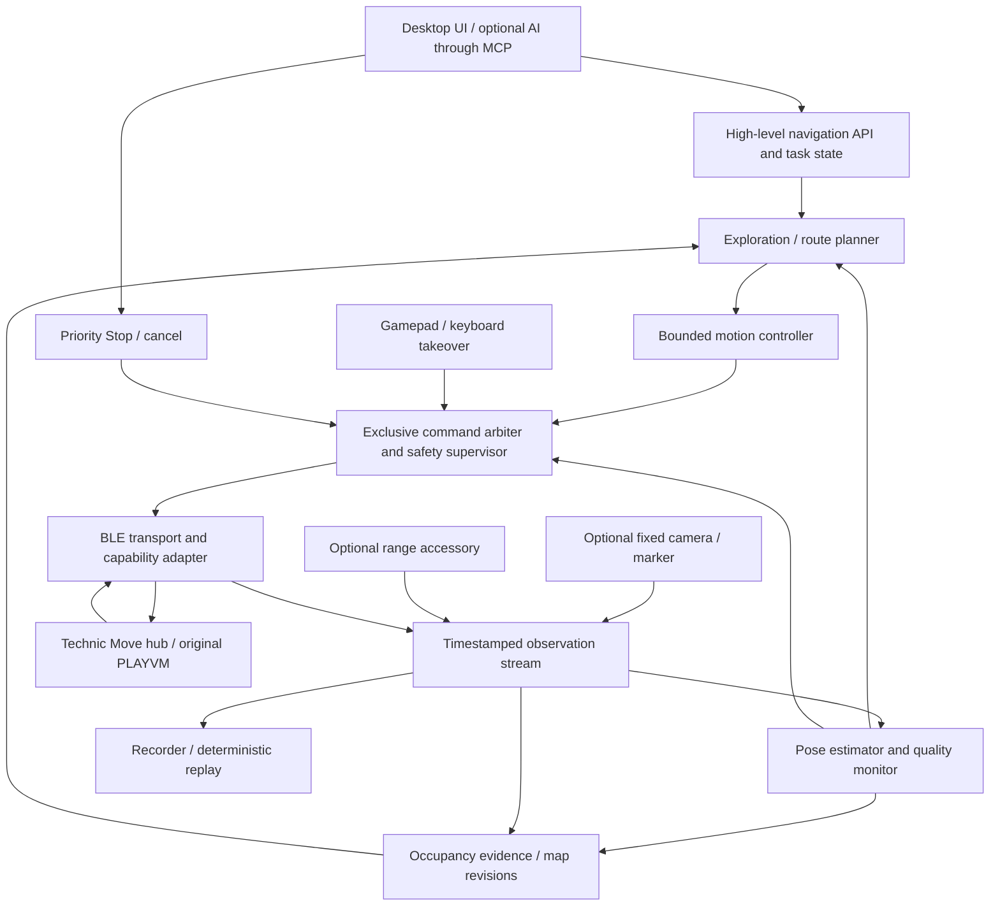

# Autonomous room mapping: feasibility and proposed design

Investigation date: **3 October 2026**. Vehicle: **42239 Batmobile Tumbler**, using the **Technic Move hub** and original LEGO firmware. This report describes a proposed system; no navigation implementation or physical driving experiment was performed.

## 1. Executive conclusion

**A useful prototype is possible. Reliable robot-vacuum-style mapping and repeatable navigation are not yet justified with the unmodified car alone.**

The hardware has more useful telemetry than the current driving session consumes. A saved scan from this user's hub advertises drive and steering motor position, three-axis gravity/acceleration, angular velocity, angular position and quaternion orientation. However, it supplies no distance measurements, independently measured tire motion, verified contact location or world-referenced position. Those missing observations matter more than the choice of SLAM algorithm.

| Proposed outcome | Feasibility | Practical interpretation |
| --- | --- | --- |
| Record current drive encoders and hub impact reports | VERY FEASIBLE | Transport and decoding already exist; a complete recorder is still needed. |
| Short-distance odometry and a live estimated trail | FEASIBLE | Requires physical distance/steering calibration; onboard IMU use also needs firmware and timing checks. |
| Approximate contact map of a small, controlled area with current hardware | EXPERIMENTAL | Could show traveled corridors and obstacle hints. Accuracy and repeatability must be measured. |
| Ordinary-room mapping for several minutes followed by dependable autonomous destinations, using only onboard telemetry and impacts | PROBABLY NOT PRACTICAL | Slip, ambiguous contacts and lack of independently identifiable landmarks can corrupt both pose and map. |
| Recover arbitrary manual relocation from the presently established onboard signals alone | IMPOSSIBLE WITH CURRENT HARDWARE | Some relocations leave no uniquely identifying observation. A human reset or external observation is needed. |
| Fixed camera + car marker + existing motor control | FEASIBLE | Best first demonstration of localization and recovery within camera coverage; mapping still needs obstacle evidence. |
| Fixed camera + marker + a forward range sensor on a separate accessory controller | FEASIBLE | Best route to a room visibly appearing without repeated deliberate collisions. |

**Recommendation:** first measure the existing telemetry and dead reckoning. In parallel, design an optional fixed-camera localization provider. For the impressive prototype, use that provider to anchor the car's pose; initially build a conservative contact map, then add non-contact ranging if autonomous discovery is the product goal. Keep all estimation, mapping and planning on the MacBook.

Collision detection is useful as a **fault/recovery signal and weak obstacle observation**. It is a poor primary source of room geometry, and it is not a general cure for position drift. A probabilistic filter cannot recover information the sensors never observed.

There is one naming correction in the repository: LEGO retail **88019 is a USB power adapter**, not the hub. The relevant hub is Technic Move, **type 0x84 / Hub No. 19**, identified by Pybricks as present in sets 42176, 42214 and 42239. It must not be confused with BOOST Move 88006 or Technic Control+ 88012. This report uses the hub name rather than the misleading retail number. [LEGO 88019](https://www.lego.com/en-us/product/lego-usb-power-adapter-88019), [Pybricks assigned numbers](https://github.com/pybricks/technical-info/blob/master/assigned-numbers.md#hub-type-ids), [Technic Move support](https://docs.pybricks.com/en/stable/pupdevices/technicmovehub.html).

## 2. Evidence and investigation scope

The relevant code was traced through discovery, port probing, BLE transport, PLAYVM startup/calibration, Tumbler control, impact handling, wheel feedback, session shutdown, JSON Lines output, Electron process ownership, renderer telemetry and wheel presentation. Relevant Python and desktop tests and the wheel-feedback engineering notes were inspected. Existing unrelated local edits were left untouched.

The strongest hardware evidence is the local [saved hub scan](</Users/olegraskin/Library/Application Support/LEGO Technic Gamepad Bridge/hub_scheme.txt:24>), whose file modification date is 28 September 2026. It contains actual device-advertised input modes and formats. That date is the file's modification date, not a timestamp embedded in the measurements. Its BLE address is intentionally omitted here.

Three evidence levels must remain distinct:

1. **Observed advertised capability:** the saved scan lists an input mode on this hub.
2. **Implemented software reader:** current code subscribes to/decodes that mode, with automated coverage of behavior.
3. **Validated physical performance:** units, accuracy, noise, latency and behavior were measured on this car under load. This investigation does not establish that level.

The scan lacks RAW/SI ranges, sensor samples, firmware revision and timing data. The repository's [wheel-feedback notes](/Users/olegraskin/IdeaProjects/lego-technic-gamepad-bridge/ui/electron/models/tumbler/wheel-feedback.md:72) explicitly leave physical end-to-end operation unverified. Existing test results and synthetic fixtures cannot supply measured sensor accuracy.

Online sources include the official LEGO protocol, manufacturer sensor documentation, Pybricks documentation and original hardware interrogation/reverse-engineering records. Reverse-engineering observations from a Porsche using this hub family are useful leads, not proof of identical Tumbler firmware behavior.

## 3. Available sensors and telemetry

In this table, “advertised” means observed in the saved scan, not bench-certified. Integer width and decimal formatting describe representation, not physical accuracy. **Unknown means unmeasured**, not zero noise or zero update rate.

| Signal | Available? / current software reads it? | Precision / resolution | Frequency | Useful for localization? | Notes / expected error |
| --- | --- | --- | --- | --- | --- |
| Drive motor shaft position | Advertised at 0x32/0x33, mode 2 POS; reader implemented | One signed int32 dataset, DEG; effective resolution/accuracy unmeasured | Change threshold 10 raw units plus current-value requests with 100 ms sleep; actual arrivals variable | Yes: relative drivetrain travel | Backlash, gearing and tire slip dominate metric accuracy. Two motors feed one shared drivetrain. |
| Rear wheel rotation / travel | Derived by current reader | Mean wheel radians from motor positions × 7/11; no independent tire sensors | Same underlying readings; UI at most 10 Hz | Yes, after calibration | Measures drivetrain rotation rather than guaranteed ground displacement. |
| Independent left/right rear wheel rotation | No established independent measurements | — | — | Would be useful, but unavailable | Port role names drive_left/right identify motors, not independent differential-drive wheel observations. |
| Motor angular speed / approximate ground speed | Can be derived from position differences; no navigation speed estimator | Quantization and timestamp jitter enter differentiation | Depends on actual position cadence and averaging window | Yes, for control/prediction | Motor SPEED mode 1 is output-only in this scan. UI speed/throttle is a command, not measured m/s. |
| Steering shaft position | Advertised at 0x34, mode 2 POS; not currently read | One signed int32 dataset, DEG; accuracy unmeasured | Unknown; no runtime subscription | Yes, after conversion to road-wheel curvature | Shaft angle is not wheel steering angle. Backlash, hysteresis and calibration origin matter. |
| Steering command | Current software publishes it | Integer command ±100 for this profile | Approximate 20 Hz control loop; UI at most 10 Hz | Weak fallback | Requested steering is not proof that the mechanism reached its target. |
| Motor POWER | Advertised input mode 0 on the three motor ports; not read | One byte, PCT; semantics under PLAYVM unverified | Unknown | Diagnostic/context | Power percentage is not current, torque, load or traveled distance. Changing input modes may displace POS subscription. |
| Motor GOPOS / STATS | GOPOS input advertised; STATS output-only; neither read | GOPOS int16 DEG; STATS three int32 datasets | Unknown | No dependable additional observation established | Names do not establish feedback semantics. Prefer POS; do not interpret STATS as a readable load sensor. |
| Gravity / acceleration candidate | Advertised 0x38 GRV, mG; not read | Three int16 values; scaling, bandwidth and noise unknown on this unit | Unknown, threshold-driven interface | Tilt/pickup/impact corroboration; little reliable position information | May contain gravity and dynamic acceleration. Vibration and filtering matter. Firmware coexistence risk below. |
| Gyroscope / angular velocity | Advertised 0x39 ROT, DPS; not read | Three int16 values; bias, scale and axes unmeasured | Unknown | Yes: relative yaw change | Bias integrates into heading drift; chassis-to-hub orientation must be calibrated. |
| Hub angular position / tilt | Advertised 0x3A POS, Deg; not read | Three int16 values; wrapping/reference/order unknown | Unknown | Possible heading/tilt observation | This is angular information, **not Cartesian x/y/z** despite the name “position.” |
| Quaternion orientation | Advertised 0x3B ORINT, QUA; not read | Four int16 values; normalization/order/frame unverified | Unknown | Possible heading/attitude source | No evidence of north-referenced yaw. Could share gyro bias and the same underlying IMU. |
| Compass / absolute yaw | No magnetometer or absolute heading reference established | — | — | Missing anchor | Gravity constrains roll/pitch, not yaw about vertical. |
| PLAYVM impact report | Status variable 1, bit 0x10000; currently decoded | Binary status; no magnitude, direction or contact coordinate | Event-driven, no measured rate/latency | Weak obstacle evidence / recovery | Detector provenance, sensitivity and persistence are unverified. |
| UI crash state | Implemented, derived from impact and command history | Three-second lockout, not a raw sensor event | Evaluated each control iteration; UI at most 10 Hz | Do not use as primary observation | Requires current/recent power ≥30% and is suppressed while braking. |
| Stall / no progress | No dedicated readable stall signal established; no classifier implemented | Could infer absent encoder rotation under active command | Candidate several-sample window, to be measured | Fault detection; weak contact evidence | Carpet, weak battery, startup and mechanical jams can resemble obstacles. Wheelspin defeats the inference. |
| Current / torque / motor load | No established readable current/torque mode | — | — | Missing independent evidence | Generic protocol overcurrent/error feedback, if supported, is not continuous load measurement. |
| Voltage | Advertised 0x3C VLT L / VLT S, mV; not read | One int16 per mode; meanings/accuracy unknown | Unknown | Operational diagnostic | May help diagnose reduced drive authority; not a pose measurement. |
| Temperature | Advertised 0x37 TEMP; not read | int16, one decimal in descriptor; accuracy unknown | Unknown | Mostly diagnostic | Potential context for gyro bias experiments. |
| Gesture flags | Advertised 0x3E GEST_BITMAP and 0x40 GEN_GEST; not read | One byte; bit meanings unknown | Unknown | Possible pickup/disturbance hints | Do not invent gesture semantics from names. |
| Hub activity statistics | Advertised 0x3D ChgAct/PlyAct/Last/Total; not read | Multi-value integer formats; semantics unknown | Unknown | Little direct value | Not established sensor acquisition timestamps or location history. |
| Range / dedicated bump switch / camera / optical flow / cliff detection | None established on the current car/hub | — | — | Main missing environmental observations | LEDs are outputs/status, not a vision sensor. Protocol support elsewhere does not imply this hardware has them. |
| Sensor receipt time | Current port-value cache records host monotonic time | Python floating-point clock; acquisition offset unknown | One timestamp per received cached value | Essential | Timing precision is not transport-latency accuracy. |
| UI event time | JSON Lines envelope records UTC emission time | ISO timestamp | At most 10 Hz for driving telemetry | For logs/presentation | Not sensor capture time and not an integration clock. |
| BLE rate / latency | Link exists; no measured distributions | Not established | Actual cadence/jitter/command latency unknown | Determines trustworthy integration/control | Connection interval, notification rate and UI publication rate are different quantities. |

Local scan evidence: [drive/steering formats](</Users/olegraskin/Library/Application Support/LEGO Technic Gamepad Bridge/hub_scheme.txt:24>), [motion sensors](</Users/olegraskin/Library/Application Support/LEGO Technic Gamepad Bridge/hub_scheme.txt:72>), [voltage/activity/gestures](</Users/olegraskin/Library/Application Support/LEGO Technic Gamepad Bridge/hub_scheme.txt:97>). Reader behavior: [wheel_feedback.py](/Users/olegraskin/IdeaProjects/lego-technic-gamepad-bridge/bridge/cars/tumbler/wheel_feedback.py:104). Command/presentation distinction: [vehicleState.ts](/Users/olegraskin/IdeaProjects/lego-technic-gamepad-bridge/ui/electron/src/renderer/src/lib/vehicleState.ts:14).

### Current timing and information loss

The encoder reader validates POS, DEG, one int32 dataset and RAW/SI scaling. It handles signed 32-bit wrap. Two samples must be within **50 ms** of each other and no older than **300 ms**. Polarity is learned passively from stable command direction and two consistent nonzero measured deltas. Initial movement before polarity is learned is not accumulated. After a stale gap, the next reading becomes a new baseline, dropping intervening travel. These choices are reasonable for animation; they are unsuitable as the sole navigation record. [Encoder sampling](/Users/olegraskin/IdeaProjects/lego-technic-gamepad-bridge/bridge/cars/tumbler/wheel_feedback.py:167).

The frontend receives telemetry at most every **100 ms**. Wheel animation interpolates with a **120 ms** presentation delay and never extrapolates beyond measured samples. Its **600 ms** expiry is a display policy. None of those settings determines the IMU's sample rate. [Protocol publication](/Users/olegraskin/IdeaProjects/lego-technic-gamepad-bridge/bridge/protocol.py:194), [wheelMotion.ts](/Users/olegraskin/IdeaProjects/lego-technic-gamepad-bridge/ui/electron/src/renderer/src/vehicle/wheelMotion.ts:3).

The protocol's delta interval is a **value-change threshold**, not milliseconds. A zero threshold requests maximal streaming; LEGO warns about BLE bandwidth. Standard single-value messages contain values and a port ID, without sensor acquisition timestamps. Request/reply timing cannot perfectly distinguish sensor sampling delay from radio/scheduling delay. [Official LEGO protocol](https://lego.github.io/lego-ble-wireless-protocol-docs/#port-input-format-setup-single).

All writes share a serialized GATT characteristic and use write-without-response. A successful host write is not confirmation of physical motion. Windows asks for preferred 7.5–15 ms connection parameters; that is not an observed Mac connection interval or guaranteed command latency. [Transport](/Users/olegraskin/IdeaProjects/lego-technic-gamepad-bridge/bridge/transport.py:189).

The raw notification queue holds **256 frames**, without receipt timestamps or overflow accounting. PLAYVM status handling drains that queue destructively and discards unrelated frames; the per-port cache keeps only the latest value. Adding a second consumer of the same drain would lose events. A recorder and estimator need a timestamped fan-out stream at ingress. [Transport cache](/Users/olegraskin/IdeaProjects/lego-technic-gamepad-bridge/bridge/transport.py:134), [status drain](/Users/olegraskin/IdeaProjects/lego-technic-gamepad-bridge/bridge/cars/tumbler/low_level_control.py:155).

### Additional capabilities and firmware uncertainty

The local scan establishes **advertised but unused** steering/IMU/voltage/gesture modes. The original [Pybricks hardware interrogation](https://github.com/orgs/pybricks/discussions/1733) corroborates those interfaces on an earlier hub of the same family and supplies nominal RAW/SI ranges. Those ranges are not accuracy specifications and must not be blindly transplanted to this unit.

A separate developer's physical Porsche experiments report repeated hub crashes after minutes of subscribing to GRV during PLAYVM operation, and a rest-value scaling different from the older descriptor conversion. Firmware revision is not established. This is **not proof that the user's Tumbler will fail**, but it makes simultaneous sensor operation a test gate before relying on IMU streams. Start with individually isolated streams, then sustained combined operation. Do not copy an accelerometer threshold from that other vehicle. [Original measured protocol notes](https://github.com/RomanJabo/brick-car-gamepad-bridge/blob/main/docs/protocol.md#accelerometer--works-and-kills-the-hub).

The transport could also be extended to interpret hub property/version/battery responses, alerts/errors, output-feedback bits, combined-mode values and currently unknown PLAYVM status bits. The existing generic inspector requests names, units, mapping and formats, but does not request/report RAW/SI limits. These are **protocol/software gaps**, not newly discovered physical sensors. Unknown messages should be recorded before being assigned a meaning. [Port inspection/parser](/Users/olegraskin/IdeaProjects/lego-technic-gamepad-bridge/bridge/transport.py:280), [official message families](https://lego.github.io/lego-ble-wireless-protocol-docs/#message-types).

## 4. Collision mapping: what works and what does not

### Contact detection

**Some impacts can be detected. Reliable low-speed contact detection has not been established.** A gentle approach to a soft object may stop with little impact. Floor joints, lifting, vibration or steering hard stops can cause disturbances without a wall contact. The PLAYVM flag's internal detector is unknown, so it must not be labeled “accelerometer collision” or “motor stall” without evidence.

The present UI crash state is especially unsuitable for slow exploration: normal mode 1 caps power at **25%**, below the **30%** crash gate. A real impact may therefore leave crash=false. Navigation should receive the raw timestamped impact edge independently of gamepad rumble/lockout policy. [CrashLockout](/Users/olegraskin/IdeaProjects/lego-technic-gamepad-bridge/bridge/feedback.py:160), [speed modes](/Users/olegraskin/IdeaProjects/lego-technic-gamepad-bridge/bridge/settings.py:31).

Encoder-based no-progress detection can be better than an impact spike for a **slow hard stop with tires that grip**. Require fresh measurements, active effort, a settling interval and persistent low rotation. It still cannot distinguish a wall from carpet resistance, a jam, insufficient torque or low battery. If the differential lets one tire spin, the drivetrain can rotate while the car remains blocked. Both motor encoders can agree perfectly during this failure.

Gyro agreement can help recognize turning slip; it cannot reliably distinguish constant straight travel from stationary straight wheelspin. Accelerometers do not measure sustained velocity, and comparing them with encoder acceleration does not solve this ambiguity in general. A camera or ground optical flow can directly detect it.

Use a classifier with separate outputs: **disturbance**, **suspected contact**, **no progress**, **suspected slip**, **pose invalid**. Only sufficiently corroborated contact should add obstacle evidence. Ordinary stop/release/braking must not create a wall.

### What a contact actually tells us

For a well-localized car, a confirmed contact says **some part of its contact-capable outline encountered something near the recent pose**. It does not provide the obstacle's extent, identity or wall normal. A corner strike or angled furniture contact may occur beside the nominal front center. The vehicle may bounce, twist or push the object before the status arrives.

Represent a contact as an uncertain footprint edge/region along a short recent trajectory, using measured detection delay. Do not stamp the car center as occupied, put a precise wall one vehicle length ahead, or infer that the wall is perpendicular to the direction of travel.

A new obstacle recorded using drifted odometry inherits that drift. **The same unknown contact cannot independently correct the pose that was used to place it.** It adds a relation between two uncertain quantities. An optimizer must retain that joint uncertainty; snapping pose to a just-created wall would manufacture confidence.

If a wall's world position and identity are independently known, a contact can constrain distance normal to that wall. Motion along the wall remains ambiguous; uncertain contact side/heading weakens the constraint. Multiple identifiable, nonparallel features can help. Repeated collisions with indistinguishable walls do not automatically establish loop closure.

### Distance, steering and drift

Encoders can give approximate distance, and calibrated steering plus distance can give dead reckoning. A gyro can improve relative heading. None supplies an independent position anchor.

Illustrative calculations, **not measurements of this car**:

| Error assumption | Result |
| --- | --- |
| 3% travel-scale error over a 20 m route | 0.6 m distance error |
| 5° heading error over a 3 m straight segment | About 0.26 m cross-track error |
| Uncorrected gyro bias of 0.1°/s for three minutes | 18° heading drift |
| Constant accelerometer bias of 0.01 g, double-integrated for ten seconds | About 4.9 m position error |

Actual drift could be smaller in calibrated smooth-floor trials or much larger during a single slip/collision. Carpet, polished floors, thresholds and uneven loading change effective rolling radius, steering curvature and slip. A larger grid hides visual detail but does not restore observability.

The expected hardware-only result is a **session-local exploration sketch**, with increasing uncertainty and occasional manual resets. A room outline that looks plausible is insufficient evidence of a map suitable for drive_to or return_to_start.

## 5. Why robot-vacuum mapping differs

A mapping robot needs both a motion prediction and observations that can distinguish where it is. Vacuum implementations vary; not every model has every sensor or builds a persistent map. iRobot's manufacturer-authored Roomba 980 description specifically documents visual localization/vSLAM, demonstrating that LiDAR is not essential. [iRobot fact sheet](https://www.multivu.com/players/English/7625951-irobot-roomba-980-vacuum-cleaning-robot/document/6bdccf3b-3472-4ad2-b7c8-2691b6c27b9b.pdf).

| Concept | What it contributes | What this car can approximate |
| --- | --- | --- |
| Wheel odometry | Short-term traveled distance/turn prediction | Mean drivetrain travel; turning inferred from steering/gyro, not independent wheels |
| IMU | Relative rotation, attitude and motion disturbances | Advertised sensors; usable timing/firmware behavior need validation |
| LiDAR | Many non-contact ranges to scene geometry; supports scan matching | Absent; a single added range sensor is much sparser |
| Camera / visual SLAM | Repeatable scene features, relative motion and place recognition | Absent onboard; external camera localization is a different but useful architecture |
| Ground optical flow | Actual ground-relative movement, reducing wheelspin error | Requires added sensor; dependent on floor texture/height and still subject to drift |
| Dedicated bumper | Contact with a known mechanical location | Existing impact flag lacks dedicated bumper geometry/side identification |
| Wall sensor | Continuous side clearance before contact | Absent; contact-only wall following cannot maintain measured clearance |
| Loop closure | Recognizes a previously observed place and constrains accumulated drift | No dependable onboard place identity; motion-pattern similarity alone is insufficient |
| Occupancy grid | Stores free/occupied/unknown evidence | Straightforward on MacBook; does not itself measure the environment |
| Cliff/lift detection | Rejects unsafe motion or invalid grounded assumptions | No established cliff sensor; pickup inference is incomplete |

Many vacuums can rotate in place using a differential drive and have a rounded, known bumper footprint. The Tumbler is a car with steering and a noncircular outline: it needs turning arcs and sometimes reverse maneuvers. Its two drivetrain motor counters do not turn it into a differential-drive platform.

The proposed combination **odometry + steering + IMU + contact + probability** is a valid experimental estimator/map pipeline. What it lacks is frequent, identifiable environmental measurement. EKF, particle filtering and pose graphs improve the treatment of uncertainty; they do not substitute for those measurements.

## 6. Alternatives and recommendation

| Approach | Benefits | Limits / extra requirements | Recommendation |
| --- | --- | --- | --- |
| Current hardware only | Smallest first experiment; no added electronics | Sparse contacts, drift, wheelspin ambiguity, difficult relocalization | Run as a bounded feasibility experiment, not the final product promise |
| Fixed phone/webcam + roof AprilTag/ArUco marker | Anchors x/y/heading; observes real movement and relocation; no wiring into hub | Stable mounting, calibration, adequate resolution/light, car visibility; occlusion under furniture | **Best first localization demonstration** |
| Camera sees room and car | Can supply obstacle outlines as well as pose | Floor-plane calibration; object height, shadows, occlusion and traversability complicate automatic segmentation | Initially allow explicit human outline annotation; label this as supplied map data |
| One forward ToF sensor | Non-contact obstacle distance, earlier stop; denser evidence than impact | Separate power/controller/link; beam footprint, surface response, sparse views; does not automatically cure pose drift | **Best first onboard ranging addition**, preferably with camera anchoring |
| One ultrasonic sensor | Coarse non-contact ranges | Wide beam, specular reflections, soft material and angled surfaces; interface/controller needed | Viable obstacle guard, weaker detailed mapping |
| Ground optical-flow sensor | Detects translation when wheel encoders mislead | Mounting height, texture, carpet/lighting dependence; does not observe walls or absolute place | Useful odometry upgrade; not sufficient alone |
| On-car camera + fixed known tags | World-referenced pose when tags are visible | Added camera/compute/link, calibration, visibility and tag placement | Useful later for movement outside overhead-camera coverage |
| On-car visual SLAM without tags | Scene-based motion and loop closures | Low camera height, motion blur, texture/lighting, monocular scale and dynamic objects; larger software effort | Later research path, not smallest maintainable MVP |

AprilTag pose estimation needs known tag size and calibrated camera intrinsics. For a fixed camera, also establish its world transform and the tag-to-vehicle transform. A simple floor homography applied to an elevated roof marker can introduce parallax; use its correct plane/height or calibrated 3D pose. The camera must remain fixed. Tag loss should stop movement after a measured bounded bridge interval, rather than silently extend odometry indefinitely. [AprilTag primary implementation](https://github.com/AprilRobotics/apriltag#pose-estimation).

Tracking the car with a camera **does not automatically map the room**. To demonstrate discovery by the car, build obstacle evidence from its contacts or range observations. If the user supplies outlines or camera segmentation supplies the whole map beforehand, call the result navigation on a supplied map.

A single ToF sensor is not a laser scan: it reports a return within a finite field of view. For example, ST specifies a nominal 27° full FoV for the VL53L1X with configurable ROI; actual ranging depends on conditions. Model the observation footprint rather than drawing a perfect infinitely narrow ray. [ST datasheet](https://www.st.com/resource/en/datasheet/vl53l1x.pdf).

There is no established plug-in expansion path in this project's all-in-one Move hub. Plan sensor additions as a separately powered accessory controller with its own BLE/Wi-Fi/USB data path to the MacBook, unless actual connector compatibility is demonstrated. It adds cost, mounting, clock synchronization and lifecycle work. Do not propose plugging a generic ToF/ultrasonic sensor into a fictitious spare hub port.

Keep the original hub firmware for this design. Pybricks currently documents that installing replacement firmware on Technic Move is blocked by its update password; peripheral control remains possible. MacBook computation avoids needing a hub SLAM program. [Pybricks support](https://docs.pybricks.com/en/stable/pupdevices/technicmovehub.html).

## 7. Recommended architecture



| Layer | Responsibility |
| --- | --- |
| AI/MCP or UI | Request intent, inspect state, name destinations, cancel. No fast motor loop or unrestricted raw BLE tool. |
| Navigation API | Validate map/frame/goal, create bounded tasks, report progress, handle cancellation, enforce one active owner. |
| Planner | Select reachable frontiers/routes, respect steering radius and footprint, replan on valid new evidence. |
| Localization | Fuse actual observations, publish pose with uncertainty/freshness, detect invalid assumptions. |
| Mapping | Maintain evidence and observation provenance; distinguish unknown, free, occupied and supplied annotations. |
| Motion controller | Follow short segments using measured travel/heading, impose speed/rate limits and check progress. |
| Command arbiter/safety supervisor | Stop precedence, manual takeover, command leases, stale-data policy, fault latching and rearm. |
| Sensor adapter / transport | Discover modes, decode units/frames, timestamp and fan out every useful observation, serialize bounded BLE writes. |
| Hub | Existing PLAYVM motor execution, steering calibration and firmware functions; no new SLAM responsibility. |
| Recorder | Preserve raw and interpreted data, calibration/version identifiers and gap events; replay without hardware. |

Use one local Python service to own the BLE connection and navigation state. Electron remains the display/process boundary. Optional camera/range providers feed the same typed observation contract. A separate local MCP adapter talks to that service; it must not open a competing BLE connection or bypass command ownership.

The current control loop sleeps 50 ms and sends drive frames only when the command changes. It is not a verified autonomous deadman. Live transport writes have no per-drive deadline; current safety limits clamp power rather than implement freshness checks. Navigation requires bounded writes and a command lease, plus physical testing of what the hub does when the process freezes or the link disappears. Host-side stop cannot guarantee motor stopping after the radio path is lost. [Control loop](/Users/olegraskin/IdeaProjects/lego-technic-gamepad-bridge/bridge/session.py:812), [GATT write](/Users/olegraskin/IdeaProjects/lego-technic-gamepad-bridge/bridge/transport.py:259), [shutdown](/Users/olegraskin/IdeaProjects/lego-technic-gamepad-bridge/bridge/session.py:612).

## 8. Localization strategy: x, y and heading

### Coordinate frames

Use meters and radians internally. Define:

- **base:** origin at the rear axle midpoint, +x forward, +y left, +z upward; heading increases counterclockwise.
- **hub:** actual sensor axes, related to base by a measured fixed rotation.
- **odom:** continuous local frame initialized at the first grounded/calibrated pose; grows uncertain with travel.
- **map:** persistent room frame, established by the starting anchor or calibrated camera reference.
- **camera/tag/range:** explicit fixed or measured transforms to map/base.

Compute `map_pose = map_to_odom × odom_pose`. A localization correction changes map_to_odom instead of pretending old odometry never happened. Persist map identity, anchor definition, calibration ID and revision. Reconnecting resets sensor baselines; it does not certify the old pose.

Do not use Three.js model units, decorative street movement or its commanded steering display angle as physical coordinates. Existing renderer steering is visual response to a normalized command. [Model display steering](/Users/olegraskin/IdeaProjects/lego-technic-gamepad-bridge/ui/electron/src/renderer/src/vehicle/tumblerModel.ts:24).

### Calibration

Before estimating position, measure effective meters per drivetrain revolution in both directions, wheelbase, steering shaft center and curvature over several shaft angles, maximum reliable curvature, backlash/hysteresis, minimum controllable speed and stopping distance. Record floor and battery conditions. Do not infer those quantities solely from nominal CAD dimensions.

The repository's mechanically documented conversion is mean rear-wheel rotation = normalized mean motor rotation × **7/11**. Both motors feed the central drivetrain/differential. Effective tire radius still needs a ground-distance calibration. [Mechanical conversion notes](/Users/olegraskin/IdeaProjects/lego-technic-gamepad-bridge/ui/electron/models/tumbler/wheel-feedback.md:9).

For the IMU: identify axes/signs by controlled motions, check scaling and orientation ordering, measure stationary bias/noise, test known rotations, resets/wrapping and stream latency. A GRV six-face test can check gravity scale if that stream is stable. Treat the firmware quaternion and gyro as correlated sources unless independence is established.

### Prediction

Let dα1 and dα2 be signed, scaled motor-angle increments in radians; p1/p2 are calibrated polarity signs and r_eff is calibrated effective rear tire radius:

```text
ds = r_eff × (7/11) × (p1*dα1 + p2*dα2)/2
δ  = f(measured_steering_shaft, direction/history)
κ  = tan(δ)/wheelbase              # or measured curvature lookup
dθ = κ*ds
x_next = x + ds*cos(θ + dθ/2)
y_next = y + ds*sin(θ + dθ/2)
θ_next = wrap(θ + dθ)
v ≈ ds/dt
```

Define δ and κ positive for a left turn. Existing bridge steering commands are positive for a right turn, so a command-based fallback must negate the normalized command before applying its calibrated command-to-angle or curvature mapping. Measured steering-shaft position requires independently calibrated polarity. Signed ds then gives the correct heading change when reversing.

The bicycle approximation is useful at low speed. A measured curvature lookup may describe the LEGO mechanism better than ideal steering geometry. The encoder difference is a consistency diagnostic, **not yaw**.

Use timestamped absolute motor positions from transport, not the viewer's accumulated radians. Reject impossible jumps and distinguish wrap, detach, reset and session change. After a packet gap, retained absolute counters may recover net shaft travel; missing steering/gyro history may still make the path unknowable. Increase uncertainty or invalidate that interval instead of drawing a precise straight connection.

### Heading and correction

If a usable gyro stream exists, relative yaw increment is the integral of the base-frame vertical rotation rate minus estimated bias. Combine it with steering-based curvature to reduce heading error and detect model disagreement. During **verified grounded standstill**, stationary rate samples can estimate bias. Zero encoder speed alone is not proof that the car is stationary in the room.

Start with an odometry/gyro estimator and explicit uncertainty propagation. Add a small EKF when camera measurements arrive, with state such as `[x, y, θ, gyro_bias]`; velocity and steering may remain measured inputs/derived outputs initially. Use sample timing and measurement quality, reject implausible camera innovations, and require several consistent observations after large jumps. Do not feed gyro-integrated yaw and a firmware quaternion derived from the same gyro as two independent absolute measurements.

For camera correction, derive map-frame x/y/heading from the marker and known transforms. Correct delayed observations at their measurement time, then replay subsequent prediction over a bounded history. Report frame age and tag quality. Out-of-view operation is a bounded odometry bridge, not a confidence-preserving mode.

Without camera/range/known landmarks, an EKF can express uncertainty but cannot prevent global drift. Keep uncertainty conservative when slip is not observable; a numerically small covariance is not evidence that wheels stayed in contact.

### When more complex tools are appropriate

| Method | Use here |
| --- | --- |
| EKF / complementary fusion | Small, maintainable local estimator; gyro/steering prediction, camera correction |
| Particle filter | Later localization against a known map with informative ranges or several plausible starting poses; contacts alone are often ambiguous |
| Pose graph | Later correction of historical poses after validated visual/range loop closures; retain raw observations for remapping |
| Occupancy-grid SLAM | Appropriate once measurements actually observe environmental geometry and place; avoid building a full SLAM stack before that |

Replaying a command sequence or seeing a similar motion pattern is not place recognition. It can propose a hypothesis, but must not create a loop-closure constraint without independent evidence.

## 9. Mapping strategy

Start with an expandable **10–20 cm grid** for a coarse prototype. This is a display/model resolution choice, **not a promised localization accuracy**. Retain continuous pose and the full physical footprint rather than rounding motion to grid cells.

Store occupancy evidence with log odds or an equivalent bounded probabilistic score. Initialize cells as unknown. Keep observation source, time, pose/calibration revision and support count so later pose corrections can rebuild the map. Maintain a separate navigation cost layer inflated for vehicle size, uncertainty and stopping distance. Occupancy and inflation are distinct. These are established navigation concepts, but this proposal does not require adopting ROS/Nav2. [Nav2 costmap documentation](https://docs.nav2.org/rolling/configuration_and_development/configuration_guide/core_servers/costmap_2d/).

**Current-hardware observations:**

- Mark a narrow swept region as provisionally traversed/free only while ground motion is credible. Its support is conditional on no slip; encoders alone cannot prove that condition.
- Stop free-space insertion across suspect contact, slip, lift or telemetry gaps. Never paint a free corridor through an interval that could have been wheelspin.
- Add uncertain contact evidence on the plausible contacting outline, distributed across pose/contact-time uncertainty. Require repeat evidence before extracting a confident wall segment.
- Keep the remainder unknown. A successful drive does not clear all space in front or alongside the vehicle.
- When pose uncertainty exceeds the useful grid scale/clearance budget, stop integrating into the persistent map; preserve the event for later replay or start a new unanchored submap.

**With ranging:** insert conservative free-space evidence along the observed beam/region before a valid return and occupied evidence near its endpoint, respecting field of view and pose uncertainty. No-return/invalid samples must not automatically clear the entire nominal range. Distinguish sensor visibility from car traversability; a beam can pass above a low obstacle.

Keep transient obstacles separate from persistent structure. Time alone does not prove an obstacle disappeared: clear/reduce its evidence using fresh contradictory observations, with cautious decay for uncertain transient items. Camera annotations and named places are explicitly supplied map data, not inferred sensor discoveries.

Store source contacts/ranges and short trajectory histories so externally corrected poses can reproject evidence. A visually closed outline produced by guessed wall fitting must not become a trusted navigation boundary.

## 10. First exploration algorithm

### Hardware-only experiment: bounded bump-and-retreat

Choose the simplest observable experiment before frontier machinery:

```text
ARMED + grounded + fresh telemetry
  -> execute a short, slow segment with time/distance budget
  -> continuously check measurements, lease and quality
  -> suspected contact/no progress: stop and classify
  -> record qualified obstacle evidence
  -> if safe, reverse a short distance through the recently traversed region
  -> execute a bounded steering arc into a new direction
  -> repeat until time, uncertainty, contact or recovery budget is reached
```

Use a seeded randomized choice of feasible arcs, with memory of recent failures and a bias away from repeatedly contacted areas. Reverse is itself a monitored maneuver; previous travel does not guarantee the space is still clear. Contact/loss faults latch paused if recovery is not justified. The car cannot simply turn in place.

This is an **experimental contact explorer**, not a complete coverage algorithm. Without a range sensor, unknown-frontier approach still means physical probing, and neither wall clearance nor loop identity can be measured reliably.

### Recommended impressive prototype: simple frontier selection

Once anchored pose and useful obstacle observations exist, identify boundaries between known free and unknown space. Choose a reachable frontier with useful expected information and low travel/turn cost. Execute short segments, reobserve and replan. Frontier exploration is a practical next step rather than a requirement for the first telemetry experiment. [Yamauchi's original frontier paper](https://www.cs.cmu.edu/~motionplanning/papers/sbp_papers/integrated2/yamauchi_frontier_explor.pdf).

With camera-anchored **contacts only**, use this as a bias for bounded probes from known free corridors; expect slow discovery. With range observations, the car can reveal space without physically traversing every cell, making frontier selection substantially more effective.

| Algorithm | Assessment for this platform |
| --- | --- |
| Randomized exploration | Best minimal contact experiment; limited coverage efficiency and no completion proof |
| Wall following | Good later with side-clearance/range sensing; contact-only behavior is coarse, slow and mechanically awkward |
| Frontier exploration | Recommended once map evidence and localization are credible; invalidate unreachable targets and bound retries |
| Bug algorithms | Useful obstacle-routing ideas, but classic boundary following assumptions need actual boundary/pose observations and car-compatible maneuvers |
| DFS-like cell exploration | Good for a discrete maze or route graph; room cells are not all directly reachable by a steering car |
| Planned sweep coverage | Later, once a reliable boundary map exists; consider footprint and turning geometry |

For early planning, a small library of calibrated straight/reverse/steering arcs is easier to validate than a general planner. Collision-check each swept outline. Later use heading-aware lattice/Hybrid-A* planning; a 2D grid path alone does not ensure a car can execute its corners. Footprint-aware planning and avoiding rotate-in-place assumptions are also discussed in [Nav2's tuning guide](https://docs.nav2.org/rolling/configuration_and_development/tuning_guide/).

## 11. Ranked failure modes and graceful recovery

Ranked by likely impact on trustworthy mapping/control, not measured failure probability.

| Priority | Failure | Detection limits | Required response / recovery |
| --- | --- | --- | --- |
| 1 | Wheelspin or lateral slip | Encoders may remain consistent; gyro detects some turning inconsistencies but not all straight slip | Stop on independent no-progress evidence; freeze mapping, enlarge uncertainty. Camera/flow/range can corroborate. Hardware-only mode must also stop when its validated travel horizon is exceeded. |
| 1 | User picks up or manually relocates car | Tilt/gesture may help; gentle level relocation may be undetectable onboard | Pause on disturbance/manual moved action; invalidate pose until camera reacquisition or deliberate known-anchor reset. Do not reconstruct translation by double-integrating GRV. |
| 1 | BLE loss, stale samples or blocked control process | is_connected can remain true during delay; no current end-to-end deadman guarantee | Lease/freshness expiry requests stop, cancels task and latches paused. Preserve uncertain stopping interval. Verify hub radio/process-failure behavior physically; reconnect never resumes an old route automatically. |
| 1 | Contact/no-progress signal missed or falsely classified | Low-speed impact gate; spinning tires; carpet and soft contact | Use raw status plus corroboration, bounded segment effort/time and conservative speed. Camera/range guard preferred; no-progress does not automatically paint a wall. |
| 2 | Odometry/heading drift too large | Filter covariance can understate unobserved slip | Stop insertion/navigation when uncertainty exceeds clearance budget; reacquire an independent anchor or start a new session/submap. Contacts with unknown objects do not reset uncertainty. |
| 2 | New sensor subscription disrupts firmware | Advertised modes do not prove reliable coexistence | Capability/firmware-specific soak test; disable failed stream and reduce mode capability. Loss of optional feedback is tolerable for manual driving, not for a navigation mode that requires it. |
| 2 | Car wedged against furniture at an angle | Impact and rotation may not identify contacting side | Stop; record broad tentative contact only; attempt one justified short retreat through known space, then ask for help. Avoid repeated powered pushing. |
| 2 | Obstacle moves or car pushes it | Contact cannot identify static vs movable structure | Keep provisional/transient obstacle evidence; reobserve before path use. Avoid global pose correction against an unverified movable item. |
| 2 | Steering recalibration, backlash, damaged mechanism | Command angle may look fine while physical curvature changed | Compare measured shaft/gyro/trajectory with calibrated model; pause and recalibrate. New calibration ID invalidates old assumptions; reanchor rather than silently continue. |
| 2 | Unknown starting position in an old map | Onboard telemetry cannot uniquely identify arbitrary start | Camera/tag relocalization, sufficiently informative future range localization, or user placing car at a named anchor. Otherwise create a new map. |
| 3 | Battery/floor change | Motor power-to-speed and stopping response vary | Control on measured progress, monitor validated voltage if available, reduce limits/pause; use calibrated floor-dependent uncertainty. Encoder distance remains biased by slip and effective radius changes. |
| 3 | Packet gaps, encoder wrap/reset/detach | Absolute counts recover travel only if reset/wrap semantics and continuity are known | Mark gaps, reject implausible deltas, check topology/session; do not assign an exact missing trajectory. Replay only defensible intervals. |
| 3 | Camera occlusion, lighting loss, camera moved | Marker disappears or reference geometry shifts | Bounded prediction bridge then stop; require consistent reacquisition and stationary reference checks. Recalibrate if camera moved. |
| 3 | Map inconsistency / false loop closure | Repeated furniture/walls can look alike | Quarantine suspect correction/submap; retain previous map revision and evidence for rebuild. Require independent support before accepting loop closure. |

The current crash lockout can expire and permit a still-held throttle again. Navigation faults must instead remain paused until an explicit rearm or a validated recovery transition. The existing shutdown sends neutral commands with brake default false; determine actual coasting/braking distance rather than assuming zero speed immediately. [Runtime crash handling](/Users/olegraskin/IdeaProjects/lego-technic-gamepad-bridge/bridge/cars/tumbler/runtime.py:278), [stop implementation](/Users/olegraskin/IdeaProjects/lego-technic-gamepad-bridge/bridge/session.py:612), [drive defaults](/Users/olegraskin/IdeaProjects/lego-technic-gamepad-bridge/bridge/cars/tumbler/low_level_control.py:119).

Define a speed-dependent clearance budget: vehicle outline plus pose uncertainty plus motion during sensing/control delay plus measured braking/coasting distance. If available clearance cannot cover that budget, stop. All fault recoveries should have an attempt/time budget and a visible reason; “I need help” is an acceptable outcome.

Without an established cliff sensor, initial trials need a level bounded floor area without drops. This is a specific hardware limitation relevant to unknown-room exploration, not something a planner can infer from wheel odometry.

## 12. Smallest experiment to prove or disprove the concept

Separate the **hardware-only test** from the **camera-assisted demonstration**. Use an external video/marker trace as evaluation ground truth in the first test, without feeding it to the estimator. Otherwise success would not test the onboard-only claim.

### Experiment A: validate observations before exploration

1. Save hub hardware/firmware metadata and per-mode RAW/SI descriptors. Record every raw event with monotonic receipt time, port/mode, session and gaps; record outgoing command times separately.
2. Begin with existing encoders and raw PLAYVM status. Check rest, manual rolls and brief controlled low-speed drives in both directions. Establish polarity physically.
3. Test steering POS and gyro individually while stationary and during known turns; verify compatibility with PLAYVM. Only test GRV/orientation candidates after the relevant firmware risk is accounted for. Then run candidate combined streams for at least the intended exploration duration, preferably 10–15 minutes.
4. Measure stationary gyro bias, axes/scales, heading change, sample interval distributions, pair skew, sensor freshness, queue loss and command-to-observed-response timing. Arrival timing is observable; true one-way BLE latency is not fully observable without synchronized device timestamps.
5. Measure one-meter forward/reverse rolls, repeated steering arcs and closed routes on intended floors at different battery states. Compare endpoint and heading with independent ground truth.
6. Label a small controlled contact dataset: straight/angled hard contact, soft obstacle, floor joint, braking, carpet stall, mechanically blocked wheelspin, pickup and user movement. Report true/missed/false events separately for raw impact and no-progress detection. Use low energy and a supervised test area; do not make full-speed crashes the experiment.

Artifacts: replayable log, telemetry inventory with measured rates/noise, calibration record, plotted ground truth versus estimated paths, detector confusion table, sensor/PLAYVM compatibility result.

### Experiment B: the actual room-map question

Use a small measured enclosure, for example 2 × 3 m, with one or two fixed obstacles and sufficient turning room. Start at a marked pose A. Run the bounded low-speed explorer for **3–5 minutes**. Do at least three repeated runs, then repeat with a floor change and deliberate disturbance. Room dimensions and durations here are proposed test choices, not capabilities already demonstrated.

Produce a 10–20 cm evidence grid and pose trail. Evaluate against ground-truth geometry after only the initial anchor alignment; do not retrospectively scale, warp or snap the result into the room outline. Compare raw odometry, odometry+validated IMU and contact-corrected estimates to learn whether each addition actually helps.

Proposed initial acceptance criteria, to agree before trials:

- No uncontrolled continuation on Stop, stale required telemetry or task cancellation; stop latency/distance meets the measured operating envelope.
- In repeated no-disturbance trials, 95th-percentile pose error ≤20 cm and heading error ≤10° over the test horizon. These are **targets**, not forecasts.
- Supported obstacle/contact regions align within roughly one or two grid cells; report unsupported/unknown boundaries, observed obstacle precision and false-free corridor area.
- No free corridor is asserted through a labeled blocked-wheelspin interval or after an invalidated pose.
- Contacts mapped to the same fixed object remain consistent across revisits without oracle wall snapping.
- The system pauses gracefully after detectable lift/stale data; an intentionally gentle undetectable relocation should be reported as an onboard limitation, not hidden as a passed recovery test.

Do not demand an entire closed room perimeter from a contact-only three-minute run, or advertise “coverage 68%” when total accessible room area is still unknown. Count observed/supported area and contact coverage against ground truth in evaluation.

**Stop/go decision:** if telemetry is unstable, contact detection misses gentle obstacles, or drift/slip creates inconsistent maps at the required horizon, end the onboard-only mapping route. That result still validates an odometry viewer and supplies calibration. Do not respond by adding a more elaborate filter with no new observation source.

### Experiment C: smallest impressive assisted prototype

Feed a calibrated fixed-camera car pose to the same estimator. Repeat the contact-mapping exploration with no preloaded obstacle map. Verify that contact regions now accumulate coherently and that visible manual relocation can be detected/relocalized while motion stays paused. If it works, add forward ranging through an accessory controller so space appears before the car touches its boundaries.

A camera-fed result demonstrates the complete navigation architecture with external localization. Keep its performance labeled separately from Experiment B.

## 13. Incremental implementation plan

Each milestone has an independently visible outcome and a gate before the next dependent step. These are proposed changes only.

| Milestone | Scope / visible result | Test or decision gate |
| --- | --- | --- |
| 1 — Capability inventory and recorder | Raw, timestamped ingress fan-out; per-port metadata, command log, sessions/gaps; replay UI | Existing manual behavior unchanged; replay preserves events without competing drains. Bench establishes usable modes, including firmware coexistence. |
| 2 — Calibrated drivetrain odometry | Measured travel in meters; raw per-motor traces, explicit discontinuities | Forward/reverse distance and closed-route errors measured; no command-derived speed substitution. |
| 3 — Heading and pose visualization | Steering POS/gyro when validated; x/y/heading trail plus uncertainty and optional ground-truth overlay | Known arcs/turns, axes, latency and bias verified; publish a maximum credible unanchored horizon. |
| 4 — Disturbance/contact/no-progress classification | Raw impact timeline and independent classifier, including low-power cases | Labeled false/missed contact and wheelspin tests; stop if required detection is unobservable. |
| 5 — Conservative occupancy evidence | Free/occupied/unknown grid, contacts and uncertainty; source observations retained | No false-free insertion through invalid intervals; assess whether hardware-only map merits continuation. |
| 6 — External anchor provider | Fixed-camera marker pose, delayed corrections, reacquisition | Camera calibration/occlusion and manual relocation checks; **recommended before multi-minute autonomy** if onboard route fails. Can be developed alongside milestones 2–5. |
| 7 — Safety and bounded exploration | Lease, manual takeover, persistent fault pause, short arc explorer | Stop/process/radio-loss tests and measured stopping envelope; supervised repeatable map trial. |
| 8 — Range/frontier exploration and destinations | Optional accessory ranging, frontier selection, heading-aware paths, return to start | Unknown-space handling, obstacle changes, turning/reverse clearance and repeated goal arrivals. Destination support depends on trusted map/pose. |
| 9 — High-level API and MCP | Bounded tasks, get_map/get_pose, explore/route/cancel; UI and agent share service | Cancellation/ownership, stale goal/map rejection, no direct motor access, route never resumes merely because BLE reconnects. |

Frontier planning and MCP come after evidence and recovery. Milestones 1–5 can falsify the collision-only idea without requiring a full autonomous stack.

## 14. Future AI / MCP contract

High-level commands should start cancellable local tasks and return task IDs, not block an AI session while driving. Proposed contract:

| Command | Meaning / preconditions |
| --- | --- |
| explore_room(bounds, time_budget) | Explore a configured area within travel/time/recovery limits; mode capability determines whether discovery uses contact or ranging |
| get_map(map_id, revision) | Return occupancy/unknown mask, resolution, origin/frame, evidence summary and named places |
| get_pose() | Return x/y/heading, map frame/revision, estimate age, uncertainty, source and valid/degraded/lost status |
| drive_to(x, y, map_id, tolerance) | Validate grounded pose and reachable clearance; task may fail with blocked/unlocalized/stale_map |
| drive_to("door") | Resolve a human-confirmed semantic label to a map goal; sensor contacts alone cannot recognize a door |
| patrol / follow_route | Execute a bounded route with progress checks and cancellation; no unbounded unattended loop |
| return_to_start() | Plan to a stored anchor using current pose/obstacle evidence; do not blindly reverse accumulated commands |
| stop() | Idempotent priority stop/cancel that bypasses planning; report stopping vs confirmed stopped honestly |
| get_task / cancel_task | Inspect completion, interruption and required user action |

Manual takeover revokes navigation ownership. Stop wins over both manual and autonomous inputs. Repeated requests use request IDs to avoid duplicate tasks. A reconnect, new calibration or unresolved pose jump cancels/pauses old motion intent; rearm establishes current state first.

Bind a future local API to the local machine by default, authenticate the agent connection and expose navigation intents rather than arbitrary BLE frames. Preserve a visible local Stop path independent of the AI. No AI decision should be required to stop on telemetry loss or a motion fault.

## 15. Product experience

Present a simple map with distinct unknown space, observed free paths and tentative/confirmed obstacle evidence. Show the car arrow, recent trail and a soft uncertainty region. Initially the map can be mostly gray; do not fill an imagined room rectangle to make exploration look complete.

| User-facing state | Behavior |
| --- | --- |
| Ready | Grounded, calibrated and requirements met; Explore enabled for the supported mode |
| Exploring / Mapping | Map evidence grows, short movements run locally; Stop remains prominent |
| Driving to destination | Named/selected target, progress and cancel; no robotics terminology required |
| Position uncertain | Slow/pause before uncertainty exceeds operating clearance; visibly soften the pose indicator |
| Lost / Finding position | Motion paused; camera reacquisition or a simple anchor-placement instruction |
| Needs help | Bounded recovery exhausted; preserve map and give one concrete next action |

Default confidence should be understandable states such as “Position reliable” and “Position uncertain.” A percentage like 84% implies calibrated probabilities of a defined event; do not invent it from covariance. Likewise, show “Area observed” or exploration progress within explicit supplied bounds instead of unknown total-room coverage.

For a hardware-only mode, “Place at start and begin” establishes a fresh local session. For the camera mode, initial setup adds camera workspace calibration and visibility checking. Later starts can feel simple because that setup is saved, but it cannot be removed from the engineering model.

Debug mode can show motor/steering counts, IMU axes/rates, pose covariance, observation age, mode discovery, BLE interarrival distributions, contact/slip/gap events and replay controls. Keep those details out of the ordinary driving view.

## 16. Concrete codebase impact

### Existing modules to extend, with focused responsibilities

| Current file | Proposed change |
| --- | --- |
| [bridge/transport.py](/Users/olegraskin/IdeaProjects/lego-technic-gamepad-bridge/bridge/transport.py:124) | Add immutable timestamped observation fan-out, raw frame/session/gap metadata, queue overflow diagnostics and bounded priority-aware writes. Keep BLE ownership and connection identity guards. |
| [bridge/hub_probe.py](/Users/olegraskin/IdeaProjects/lego-technic-gamepad-bridge/bridge/hub_probe.py:104) | Report firmware/capability metadata, RAW/SI ranges and decoded formats; preserve unknown device/mode descriptions. This is metadata inspection, separate from enabling streams or moving motors. |
| [bridge/port_map.py](/Users/olegraskin/IdeaProjects/lego-technic-gamepad-bridge/bridge/port_map.py:17) | Preserve existing required actuator roles; add optional sensor-capability discovery without treating port number as sensor identity or absence as manual-drive failure. |
| [bridge/cars/tumbler/low_level_control.py](/Users/olegraskin/IdeaProjects/lego-technic-gamepad-bridge/bridge/cars/tumbler/low_level_control.py:94) | Publish raw PLAYVM status observations with receipt times before lockout reduction; use subscription/fan-out rather than competing queue drains. Keep existing startup/calibration command bytes. |
| [bridge/cars/tumbler/wheel_feedback.py](/Users/olegraskin/IdeaProjects/lego-technic-gamepad-bridge/bridge/cars/tumbler/wheel_feedback.py:24) | Eventually consume the shared sensor provider for presentation. Preserve its viewer semantics; build navigation from raw absolute positions, not its gap-dropping accumulator. |
| [bridge/cars/tumbler/runtime.py](/Users/olegraskin/IdeaProjects/lego-technic-gamepad-bridge/bridge/cars/tumbler/runtime.py:129) | Keep manual input/effect resolution; extract a shared resolved motion-command contract so navigation can use the same actuator path without pretending to be a joystick. |
| [bridge/session.py](/Users/olegraskin/IdeaProjects/lego-technic-gamepad-bridge/bridge/session.py:674) | Own telemetry/nav/provider lifecycle and exclusive controller arbitration; separate manual readiness from autonomous readiness, integrate priority stop and fault latching. |
| [bridge/safety.py](/Users/olegraskin/IdeaProjects/lego-technic-gamepad-bridge/bridge/safety.py:1) | Keep power clamps; add a separate motion safety policy/lease/freshness layer rather than treating clamps as autonomy protection. |
| [config/models/tumbler.json](/Users/olegraskin/IdeaProjects/lego-technic-gamepad-bridge/config/models/tumbler.json:1) and [model_profiles.py](/Users/olegraskin/IdeaProjects/lego-technic-gamepad-bridge/bridge/cars/model_profiles.py:1) | Reference model geometry and sensor-adapter capabilities. Store measured, per-car calibration separately with versioning; avoid invented default wheelbase/steering values. |
| [bridge/protocol.py](/Users/olegraskin/IdeaProjects/lego-technic-gamepad-bridge/bridge/protocol.py:39) and [dashboard.py](/Users/olegraskin/IdeaProjects/lego-technic-gamepad-bridge/bridge/dashboard.py:1) | Add typed observation/pose/map/task status and high-level task input; retain current display telemetry. Define protocol version/capability negotiation. |
| [shared/bridge.ts](/Users/olegraskin/IdeaProjects/lego-technic-gamepad-bridge/ui/electron/src/shared/bridge.ts:1), [bridgeProcessService.ts](/Users/olegraskin/IdeaProjects/lego-technic-gamepad-bridge/ui/electron/src/main/bridgeProcessService.ts:1), [preload/index.ts](/Users/olegraskin/IdeaProjects/lego-technic-gamepad-bridge/ui/electron/src/preload/index.ts:1) | Extend validated protocol/IPC with navigation intents and snapshots; preserve process ownership, renderer trust and Stop behavior. |
| [useBridgeController.ts](/Users/olegraskin/IdeaProjects/lego-technic-gamepad-bridge/ui/electron/src/renderer/src/hooks/useBridgeController.ts:1), [App.tsx](/Users/olegraskin/IdeaProjects/lego-technic-gamepad-bridge/ui/electron/src/renderer/src/App.tsx:1), [DiagnosticsView.tsx](/Users/olegraskin/IdeaProjects/lego-technic-gamepad-bridge/ui/electron/src/renderer/src/components/DiagnosticsView.tsx:1) | Map/task state, exploration controls, uncertainty/recovery display and replay diagnostics. |

### Proposed new modules — names are a design sketch, not created files

```text
bridge/telemetry/events.py                 immutable frames, timestamps, quality, fan-out
bridge/telemetry/recorder.py               append/replay records, session/calibration metadata
bridge/cars/tumbler/sensors.py             validated shaft/IMU/status adapter
bridge/navigation/types.py                Pose2D, frames, covariance, MotionCommand, task states
bridge/navigation/calibration.py          meters/count, curvature, transforms, versioned records
bridge/navigation/odometry.py             raw counter integration, resets/gaps, relative pose
bridge/navigation/localization.py         heading fusion, optional EKF, external corrections
bridge/navigation/events.py               disturbance/contact/no-progress/slip hypotheses
bridge/navigation/mapping.py              occupancy evidence, provenance and remapping
bridge/navigation/planning.py             calibrated arcs first, heading-aware routes later
bridge/navigation/exploration.py          bounded probe/frontier task state machine
bridge/navigation/controller.py           measured segment tracking and progress checks
bridge/navigation/supervisor.py           ownership, leases, freshness, pause/rearm, recovery budget
bridge/navigation/service.py              local high-level task API
bridge/localization/camera.py              optional calibrated tag provider
bridge/sensors/range_accessory.py          optional separate sensor link
bridge/mcp/server.py                       later thin adapter to navigation service
ui/electron/src/renderer/src/components/RoomMap.tsx
ui/electron/src/renderer/src/lib/navigationState.ts
```

Start with a few small modules, not this entire tree. Add interfaces when a second provider/consumer needs them. Important contracts are timestamped observations with frame/units/quality, a pose provider with explicit validity, a resolved bounded motion command, a single owner arbiter, and cancellable navigation tasks.

### Preserve existing behavior

Do not rewrite PLAYVM startup/calibration, bypass transport write serialization, reinterpret gamepad power as velocity, use the 3D viewer as a pose source, or rewrite unrelated controller/platform/audio/lighting/release systems. Preserve existing manual shutdown and trust boundaries. New navigation safety should supplement those mechanisms; code restructuring must not weaken them.

Existing tests remain useful for PLAYVM/transport/session regressions. Future meaningful tests should use replayed sensor traces and explicit invariants: no hidden travel across gaps, no false-free map insertion during labeled slip, delayed camera correction, raw low-power impacts, bounded recovery, manual takeover and cancellation/stop ownership. Physical calibration, sensing cadence and radio-failure stopping behavior still require bench acceptance; simulated tests cannot certify them.

## 17. Decision before implementation

Proceed first with **telemetry recording, capability/firmware verification and calibrated pose visualization**. Treat collision-only room mapping as a falsifiable experiment. If it fails the multi-minute drift/contact tests, retain that work and move to fixed-camera anchoring rather than forcing the original concept.

The promising product is a car with a trustworthy external pose reference and a conservative map that visibly earns each piece of geometry. The current hardware can supply motion and disturbance information; reliable environmental observation and graceful relocalization are the decisive next capabilities.
